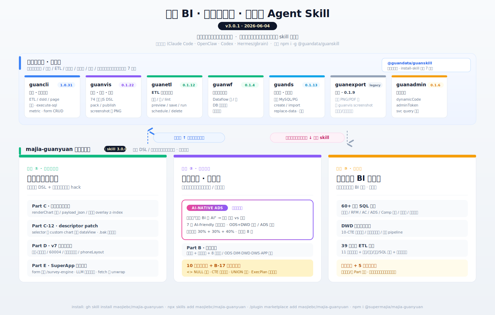

# majia-guanyuan · 观远 BI 通用 Agent Skill

> **工具无关**的观远 BI / Guandata Agent Skill — 数据查询 / ETL 治理与写入 / 自定义图表开发，**全栈三合一**。
> 兼容 **Claude Code** · **OpenClaw** · **Codex** · **Hermes (gbrain)** 等所有支持 SKILL.md 的 agent 工具。
> 60+ 张 ETL 创建/重构/修复 + 治理扫描 + 自定义图表注入排障的真实战场记录。

[](./SKILL.md)
[](https://github.com/maojiebc/majia-guanyuan/releases)
[](https://skills.sh/maojiebc/majia-guanyuan)
[](./LICENSE)
[](https://docs.claude.com/en/docs/claude-code/skills)
[](https://docs.openclaw.ai/tools/skills)
[](https://developers.openai.com/codex/skills)
[-✓-darkgreen)](https://github.com/garrytan/gbrain)
[](https://www.codebuddy.cn)
[](https://qoder.com)
[](https://www.guandata.com/)

**[English README](README.en.md)** · 中文文档 ↓

---

## 概述

本 Skill 整合了观远 BI 的三大类操作能力到**一份 Claude Code Skill** 里，让 AI 既能日常查数据出报表，又能做严肃的 ETL 治理与写入，还能处理自定义图表的前端注入排障。

<p align="center">
  
</p>

| Part | 能力 | 触发场景 |
|---|---|---|
| 🅰️ **A** | 数据查询与卡片创建 | "查 2 月各城市营业额" / "做一张交叉表" / "删掉这张卡片" |
| 🅱️ **B** | ETL 治理与写入 | "扫一遍 ETL 看哪些可以删" / "建一个 ETL" / "direct-save 报错怎么修" |
| 🅱️ **B-17** | 全链路重写方法论 | "把这条 SmartETL 链整个改成 SQL 版" / "副本页验收 / 卡片级对比" |
| 🆎 **C** | 自定义图表开发与排障 | "payload_json 解析失败" / "固定卡片错位" / "overlay 切页残留" |

---

## ✨ 效果

### 数据分析侧（Part A）

- ✅ 26 种图表类型一键建卡 + 取数（柱状图、折线图、交叉表、组合图、气泡图……）
- ✅ 自定义公式字段（动态 `SUM(x)/SUM(y)*100` 类计算列，无需提前在 BI 界面建好）
- ✅ 多表 / 多页面 / 多字段缓存机制（按任务隔离 `--task` 名）
- ✅ 26 种聚合 + 13 种筛选操作符 + 6 种日期粒度（年/季/月/周/日/星期）
- ✅ 自动处理观远 7.0+ 的 draft-release 机制

### ETL 治理写入侧（Part B）

- ✅ **11 个已实测 BI HTTP API endpoint**（POST/GET/DELETE/OPTIONS 全覆盖）
- ✅ **批量治理扫描**：构建依赖图 → 检测循环依赖 → 计算复杂度 → 8 维 ETL + 4 维字段去留判断
- ✅ **ODS/DIM/DWD/DWS/APP 五层架构**重组指引
- ✅ **字段使用度双源审计**（page + etl 双源 grep，避免**仅看板会高估 8 倍可裁字段**）
- ✅ **POST /api/etl/direct-save** create + update 同接口的完整 payload schema
- ✅ **task error 真错误定位**（`status:FINISHED` 是任务触发结果，真错误在 `GET /api/task/<id>.response.result.error`）
- ✅ **删除拓扑**：`DELETE /api/data-source/` 必须先于 `DELETE /api/etl/`
- ✅ **v2→v3 批量改造 SDK**：`transformV2ToV3()` 7 步重写 + 节点 ID 重映射
- ✅ **CTO 张进的全链路重写方法论**：4 件交付 + 8 条硬规则 + 5 步标准工作流 + 三层验收 + 差异追踪 5 步法 + 空快照处理标准

### 自定义图表侧（Part C）

- ✅ **`renderChart` 4 参数 runtime 契约**详解（不是把第一个参数当 DOM 根节点）
- ✅ **5 种 `data` 形态**识别
- ✅ **payload_json 截断判断 3 步**（`Unterminated string` → 优先改数据方案，不堆兼容逻辑）
- ✅ **拆列推荐方案**（替代单字段长 JSON）
- ✅ **z-index 基线**（容器 8 / mask 1 / 固定卡 20）
- ✅ **生命周期管理**（URL 不匹配/编辑态/phoneView/路由离开 → 销毁注入物）
- ✅ **MutationObserver 死循环陷阱**（用低频轮询 + 精准 rect 比较替代）
- ✅ **复制页 card id 重定位**（不会显式报错，只会悄悄失效）
- ✅ **真实浏览器验收 8 项**

### 报错修复手册

- 🔧 **10 类 ETL 高频报错**：`请输入ETL名称` / `保存路径无效` / 上游运行权限不足 / 字段隐藏换行 / `<> NULL` / relativeFieldAlias 错位 / CTE 内 `;` / self-join 别名同名 / UNION 列差 / 字符串字面量与 DATE 比较

---

## ✅ 适合 / ❌ 不适合

### ✅ 适合

- 在观远 BI（Guandata 6.x / 7.x）上做日常数据分析、出报表
- 做 ETL 治理（识别循环依赖、判断字段去留、重新分层）
- 批量重建 ETL（30+ 张 v2→v3 改造）
- 做副本页验收 / 卡片级对比 / 差异追踪
- 自定义图表 HTML/CSS/JS 注入开发与排障
- 不会写代码但想让 AI 帮你完成上面这些事

### ❌ 不适合

- 用其他 BI 平台（Tableau / Power BI / Superset）—— 本 skill 只针对**观远 BI / Guandata**
- 完全不允许调用底层 HTTP API 的合规环境
- 没有 BI 账号 + 写权限（Part B 写入需要 ETL 创建权限 + 数据集运行权限）

---

## 🔌 兼容性 / Compatibility

本 skill **工具无关**，凡是支持 `SKILL.md` frontmatter 标准的 agent 都能加载。已在以下工具上验证：

| 工具 | 状态 | 安装路径 | 入口文件 | 备注 |
|---|:---:|---|---|---|
| **Claude Code** | ✅ 已验证 | `~/.claude/skills/majia-guanyuan/` | `SKILL.md` | 原生支持 |
| **OpenClaw** | ✅ 已验证 | `~/.openclaw/skills/majia-guanyuan/` 或 `<workspace>/skills/majia-guanyuan/` | `SKILL.md` | 大小写敏感 |
| **Codex (OpenAI)** | ✅ 已验证 | `~/.codex/skills/majia-guanyuan/` 或 `<repo>/.codex/skills/majia-guanyuan/` | `SKILL.md` + 仓库根 `AGENTS.md`（项目指令） | 见 [Codex skills docs](https://developers.openai.com/codex/skills) |
| **Hermes / gbrain** | ✅ 已验证 | `<workspace>/skills/majia-guanyuan/` | `SKILL.md` + 仓库根 `AGENTS.md`（resolver） | 见 [garrytan/gbrain](https://github.com/garrytan/gbrain) |
| **Cursor / Aider** 等 AGENTS.md-aware | 🟡 理论兼容 | 任意 | `AGENTS.md` 作项目指令 | 仅会用到 Part A/B/C 的 navigation pointer |
| 其他 | 🟡 通用清单 | 任意 | `manifest.json` 作工具无关元数据 | frontmatter + manifest 双保险 |

## 📦 安装

> **本仓库以 git 为唯一 source of truth**，未发布到 npm registry。但保留了一行 install 体验——通过 `node bin/install.js` 或 `npx github:` 直接走 GitHub。

### 方式 0：GitHub CLI `gh skill`（GitHub CLI 2.90.0+）

```bash
# 安装到用户级 Codex / Claude Code / OpenClaw / Qoder 等 agent
gh skill install maojiebc/majia-guanyuan majia-guanyuan --agent codex --scope user
gh skill install maojiebc/majia-guanyuan majia-guanyuan --agent claude-code --scope user
gh skill install maojiebc/majia-guanyuan majia-guanyuan --agent openclaw --scope user
gh skill install maojiebc/majia-guanyuan majia-guanyuan --agent qoder --scope user

# 安装前预览
gh skill preview maojiebc/majia-guanyuan majia-guanyuan
```

### ⭐ 方式 1：克隆 + 内置 install CLI（推荐）

```bash
# 一键克隆 + 自动安装到当前机器上所有已装的 agent 工具
git clone https://github.com/maojiebc/majia-guanyuan.git ~/majia-guanyuan
cd ~/majia-guanyuan
node bin/install.js install                  # 自动检测全装
node bin/install.js install --tool claude-code
node bin/install.js install --tool openclaw
node bin/install.js install --tool codex
node bin/install.js install --tool hermes
node bin/install.js install --tool all       # 4 个全装

# 其他命令
node bin/install.js list                     # 列出当前安装情况
node bin/install.js uninstall --tool codex   # 移除（自动备份你的 config.json）
```

### 方式 2：`npx` 直接走 GitHub URL（不需要 clone）

```bash
# 一行装，npx 自动从 GitHub 拉取并跑 bin/install.js
npx github:maojiebc/majia-guanyuan install --tool claude-code
npx github:maojiebc/majia-guanyuan install --tool all
```

**`bin/install.js` 行为**（两种方式相同）：
- 自动复制 `SKILL.md` / `AGENTS.md` / `manifest.json` / `scripts/` / `references/` 等到目标工具的 skill 目录
- 自动 `cp config.example.json → config.json`，提示你编辑填凭据
- **永远不覆盖你已有的 `config.json`**（保留真凭据，再装一次也不丢）
- 已装时默认跳过，要 `--force` 才覆盖

### 方式 3：手动 `git clone` 直接放到工具 skill 目录

```bash
# Claude Code
git clone https://github.com/maojiebc/majia-guanyuan.git ~/.claude/skills/majia-guanyuan

# OpenClaw（个人级）
git clone https://github.com/maojiebc/majia-guanyuan.git ~/.openclaw/skills/majia-guanyuan

# Codex（个人级）
git clone https://github.com/maojiebc/majia-guanyuan.git ~/.codex/skills/majia-guanyuan

# Codex（项目级）
git clone https://github.com/maojiebc/majia-guanyuan.git <your-repo>/.codex/skills/majia-guanyuan

# Hermes / gbrain（workspace 级）
git clone https://github.com/maojiebc/majia-guanyuan.git <your-workspace>/skills/majia-guanyuan
```

然后配置凭据（所有工具相同）：

```bash
cd <安装路径>
cp config.example.json config.json
vim config.json  # 填入 BI base_url / login_id / password / default_pg_id / default_folder_id
```

### 方式 4：OpenClaw / ClawHub 一键安装

```bash
openclaw skills install majia-guanyuan
clawhub install majia-guanyuan
```

> ClawHub 可能显示安全扫描提醒：本 skill 包含一个本地 Python 客户端，会按观远接口要求把登录凭据编码后发送到用户自己配置的 `base_url`。安装前可先阅读 [SECURITY.md](./SECURITY.md) 并检查 [scripts/guandata.py](./scripts/guandata.py)。

### 方式 5：Hermes skillpack 安装（如发布到 gbrain registry）

```bash
gbrain skillpack install majia-guanyuan
```

### 依赖（所有工具相同）

```bash
# Python 依赖（Part A）
pip install httpx

# guancli（Part B/C 必需）
npm install -g @guandata/guancli
guancli auth login   # 配置 BI 登录
```

---

## ⚙️ 配置

把 `config.example.json` 复制为 `config.json` 后填入真实凭据：

```json
{
  "version": "6",
  "base_url": "https://your-bi-instance.example.com/",
  "domain": "guanbi",
  "login_id": "your_username@example.com",
  "password": "<BI_LOGIN_PASSWORD>",
  "default_pg_id": "your_default_page_id",
  "default_folder_id": "your_default_folder_id"
}
```

| 字段 | 必填 | 说明 |
|------|:----:|------|
| `version` | ✅ | `"6"`（观远 BI 6.x）或 `"7"`（观远 BI 7.0+，支持 draft/release） |
| `base_url` | ✅ | BI 实例地址，如 `https://bi.company.com:8080` |
| `domain` | ✅ | 登录域，通常为 `guanbi`（具体咨询 BI 管理员） |
| `login_id` | ✅ | BI 登录账号 |
| `password` | ✅ | BI 登录密码（**明文，仅供本地使用，已被 .gitignore 排除**） |
| `default_pg_id` | | 默认页面 ID（建卡时不传 `pg_id` 用这个） |
| `default_folder_id` | | 默认文件夹 ID（创建新页面时使用） |

> ⚠️ `config.json` 已被 `.gitignore` 排除，**不会被 commit 到仓库**。但请仍然小心保管，不要在公开环境分享。

---

## 🚀 快速开始

### Part A：建卡取数（数据分析）

```bash
# cwd 切到 skill 安装目录，所有命令用相对路径
cd <skill_install_path>  # 例如 ~/.claude/skills/majia-guanyuan/

SCRIPT="python3 ./scripts/guandata.py"

# 1. 列数据集
$SCRIPT list-datasets

# 2. 看字段
$SCRIPT get-columns <ds_id>

# 3. 一步建卡 + 取数
$SCRIPT create-and-get '{
  "name": "2 月各城市营业额",
  "ds_id": "<dataset_id>",
  "chart_type": "BASIC_COLUMN",
  "pg_id": "<page_id>",
  "row": ["城市"],
  "metric": [{"name": "销售额", "aggr": "SUM"}],
  "filters": [{"name": "营业日期", "op": "BT", "value": ["2026-02-01", "2026-02-28"]}],
  "sorting": [{"name": "销售额", "order": "DESC"}]
}'
```

### Part B：建 ETL（数据建模）

```bash
# 1. 治理扫描
guancli etl tree
guancli --raw etl get <id> > raw/<id>.json
# 本地脚本分析依赖图、循环组、复杂度 → analysis.json + governance-report.md

# 2. 建 v2 目录（ETL + DATA_SET 各一个）
guancli fetch POST /api/directory \
  '{"name":"warehouse_v2","parentDirId":"<父>","dirType":"ETL"}'
guancli fetch POST /api/directory \
  '{"name":"warehouse_v2","parentDirId":"<父>","dirType":"DATA_SET"}'

# 3. 写入 + 执行
guancli fetch POST /api/etl/direct-save --stdin < payload.json
guancli fetch POST /api/etl/execute '{"dataFlowId":"<id>"}'

# 4. 失败定位（关键！别只看 status:FINISHED）
guancli fetch GET /api/task/<taskId> | jq '.response.result.error'
```

### Part C：自定义图表（前端排障）

```javascript
// 观远 runtime 真实签名（不是把第一个参数当 DOM 根节点！）
function renderChart(data, clickFunc, config, helpers) {
  // data 常见形态：
  // [[ {name:"payload_json",data:["{...}"]}, {name:"report_date",data:["2026-03-18"]} ]]

  // 关键：如果 JSON.parse(payload_json) 报 Unterminated string
  //  → 优先判断为"数据链路截断"，改数据方案（拆列），不堆前端兼容逻辑
}

new GDPlugin().init(renderChart);
```

---

## 📁 目录结构

```text
majia-guanyuan/
├── SKILL.md                          # AI 读的主文档（Part A + B + C）
├── AGENTS.md                         # Codex 项目指令 / Hermes resolver（V1.3 新增）
├── manifest.json                     # 工具无关 skill 元数据（V1.3 新增）
├── README.md                         # 本文件（中文）
├── README.en.md                      # English README
├── ATTRIBUTIONS.md                   # 致谢与来源
├── LICENSE                           # MIT
├── config.example.json               # 配置模板（公开版）
├── config.json                       # 你的真实凭据（gitignore 排除，不会 commit）
├── .gitignore
├── scripts/
│   ├── guandata.py                   # Part A 主脚本（建卡 / 取数 / 删卡 / 发布页面）
│   └── zonedata_builder/             # zoneData 构建模块
└── references/                       # 深度参考资料 (V1.5.0 progressive disclosure 重构后 12 份)
    ├── part-a-commands.md            # Part A 完整命令清单 + 缓存机制（V1.5.0）
    ├── part-a-cards.md               # 卡片参数 + 26 图表类型 + 6 示例（V1.5.0）
    ├── part-b-errors.md              # Part B 10 类报错详方案（V1.5.0）
    ├── part-b-payload.md             # ETL payload schema 详解（V1.5.0）
    ├── part-b-sdk.md                 # v2→v3 批量改造 SDK（V1.5.0）
    ├── part-b17-fullchain-rewrite.md # B-17 全链路重写方法论全章节（V1.5.0）
    ├── part-c-payload-json.md        # C-3 payload_json 排障详解（V1.5.0）
    ├── guancli-commands.md           # guancli 9 大类命令速查（V1.5.0）
    ├── custom-chart-playbook.md      # CTO 张进自定义图表完整排障手册原文（V1.1）
    ├── etl-rewrite-original.md       # CTO 张进 SmartETL 改写经验原文（V1.1）
    ├── execplan-spec.md              # OpenAI Codex ExecPlan 规范（V1.2）
    └── agents-rule.md                # OpenAI Codex 极简调度规则（V1.2）
```

---

## 🎯 何时用 Part A / B / C

| 用户需求 | 走 |
|---|---|
| "查一下 2 月各城市营业额" | A |
| "做一张交叉表给我" | A |
| "删掉这张卡片" | A |
| "扫一遍 BI 的 ETL 看哪些可以删" | B |
| "ETL 之间有循环依赖怎么办" | B |
| "帮我新建一个 ETL" | B |
| "direct-save 报错怎么修" | B |
| "字段使用度审计" | B |
| "把这条 SmartETL 链整个改成 SQL 版" | **B-17** |
| "做副本页验收 / 卡片级对比" | **B-17** |
| "上游空快照怎么写结论" | **B-17** |
| "差异定位到底在 SQL 还是执行时点" | **B-17** |
| "30+ 表跨多日工程怎么管 / 给我 ExecPlan 骨架" | **B-17.11** |
| "自定义图表脚本不执行 / payload_json 报错" | **C** |
| "固定卡片错位 / overlay 切页残留" | **C** |
| "renderChart 第一个参数到底是啥" | **C** |

---

## 👤 作者 / 联系

**马甲（@maojiebc）** · 超级马甲

如果这份 skill 帮到你，欢迎在以下任意渠道找我交流踩坑实录、提需求、报 bug，也欢迎切磋用户运营 / 数据中台 / BI 工程的实战经验：

| 渠道 | 链接 |
|---|---|
| 📧 Email | [m9224@163.com](mailto:m9224@163.com) |
| 🐙 GitHub | [github.com/maojiebc](https://github.com/maojiebc) |
| 🪝 ClawHub | [clawhub.ai/p/maojiebc](https://clawhub.ai/p/maojiebc) |
| 🐦 X | [@maojiebc](https://x.com/maojiebc) |
| 📕 小红书 | [超级马甲](https://xhslink.com/m/4fQMJeHHWKC) |
| 📰 微信公众号 | **超级马甲** |

> 这份 skill 是 14 年用户运营 + 观远 BI 实战 + 60+ 张 ETL 写入实证沉淀出来的，问题/合作随时聊。

---

## ❤️ 致谢与来源

本 skill 站在多个前辈项目和经验贡献者的肩膀上，详细致谢见 [ATTRIBUTIONS.md](./ATTRIBUTIONS.md)：

- **[guandata-bi @ ClawHub](https://clawhub.ai/skills/guandata-bi)** — 观远 BI 通用版 skill，本项目最早的灵感来源
- **[zhengyuhe123/guandata](https://github.com/zhengyuhe123/guandata)** — guandata 原始 GitHub 项目
- **小小郑3号 · guandata70** — 观远 7.0+ 适配版（draft/release 机制），本项目 Part A 的直接前身
- **观远 BI CTO 张进** — Part B-17（SmartETL 全链路重写方法论）+ Part C（自定义图表开发与排障）的核心经验贡献者
- **OpenAI Codex** — V1.2 引入的 [ExecPlan 规范](./references/execplan-spec.md)（自包含活文档 + 四章节项目管理结构），用于 30+ 张表跨多日 SmartETL 重写工程的项目化追踪
- **马甲（@maojiebc）** — Part A/B 实战整合与 60+ 张 ETL 写入实证记录

> 没有 ClawHub / 张进 / 小小郑3号 / OpenAI Codex 的开源精神，这份 skill 不可能存在。

---

## 📋 版本记录

**最新：V2.1.11** (2026-05-22) — **docs-only patch：落地 ota-skill v0.14.0 新 Step 5.5（README/SKILL.md 用户首屏 HARD GATE）**。规则：版本徽章同步、版本记录段 ≤ 3 条 entry、visual asset alt 文字同步。本次执行：(a) README.md / README.en.md / SKILL.md 末尾的"版本记录" / "Version History" 段从堆叠 11 条（V2.1.10..V2.1.0）截断到只留最新 3 条（V2.1.11 / V2.1.10 / V2.1.9），更早的归 CHANGELOG.md；(b) README 顶部架构图 alt 从 "v2.1.3 功能图" 同步到 "v2.1.11 功能图"，把 Part D（V7 发布流水线 + customChart autoBootstrap + chip toolbar + 移动端 phoneLayout ZIP inject）+ 餐饮 BI 公式实战库都写进 alt；(c) Skill Version badge / SKILL.md 主标题 / 末尾版本字符串 / metadata.version / manifest+package version 全部同步到 v2.1.11。零代码 / 零 references 改动。

**V2.1.10** (2026-05-21) — **`references/v7-page-card-publish-pipeline.md` §16 移动端 phoneLayout 完整指南 + v7 草稿 save API 死路**（~330 行）。沉淀自同一天给 9 个 demo 看板（01-高层经营驾驶舱 / 02-会员私域驾驶舱 / 03-会员经营任务池 / 04-门店每日指挥台 / 05-活动权益复盘 / 06-体验风险专题 / 07-单店利润健康 / 08-加盟商单店报告 / 09-总览-ECharts 重构）做移动端适配的 30+ 轮 API 探索：v7 BI 草稿 save 没有可用 REST 端点（**8 个候选端点全部 stub / 404**），前端走非 REST 通道（WebSocket / Redux 内部 batch）；唯一可行路径是 `guanvis-skill pack` → Python 脚本注入 phoneLayout 到 `page.meta` 字符串（**必须 `json.dumps` 不能塞 dict，否则 `error.expected.jsstring`**）→ `guanvis-skill upload` 走 transfer API 直接覆盖发布版。配套：phoneLayout 五字段结构（selector 必须包在 `group_AUTO_PHONE` 容器、`mobileHeightUnit:60`、customChart `h=40 ≈ 572px` 装下 4 KPI + 4 图表）+ CSS @media 768px/480px 模板（KPI 4→2 col + `html, body { height: auto }` 解锁 iOS 滚动）+ `scripts/inject_phone_layout.py` 工具脚本可直接复用。

**V2.1.9** (2026-05-21) — **`references/v7-page-card-publish-pipeline.md` §15 customChart 三大坑 + autoBootstrap + chip toolbar 兜底**（~180 行）。同一天把 8 个 HTML SDK customChart 看板调通：§15.1 BI 不自动调 `renderChart`（race condition，同一份代码 03 能跑 07 不能跑）必须 iframe 顶部 `autoBootstrap` 5 秒兜底 `POST /api/card/<cdId>/data` 拿数据手动喂 `renderChart`；§15.2 selector 联动失败（autoBootstrap 绕过 BI redux dispatch + 7 种 body filter 格式 BI 全不认 + `PAGE_DATA_SDK.initPage()` 卡 `pgId`）；§15.3 终极兜底 chip toolbar 模式（每个 dataView 加 `addRow(f("门店类型"))` + JS 顶部 state + CSS 渐变样式，03/04/06/07/08 5 个看板已用）；§15.4 何时用 selector / 何时用 chip toolbar（基数 ≤10 强推 chip）；§15.5 排查 checklist。


完整变更历史见 [CHANGELOG.md](CHANGELOG.md) 或 [GitHub Releases](https://github.com/maojiebc/majia-guanyuan/releases)。

## 🤝 贡献

欢迎 issue 和 PR：

- 🐛 发现报错没在手册里的：欢迎提交 issue 描述报错信息 + payload + 真实错误（`/api/task/<id>.response.result.error`）
- 📝 你跑通了新的 BI HTTP API endpoint：欢迎补充到 Part B 的 API 全图
- 🎨 自定义图表新场景：欢迎补充到 Part C
- 📚 文档优化、翻译、错别字修正：直接 PR

---

## 📄 License

[MIT](./LICENSE) © 2026 [maojiebc](https://github.com/maojiebc) and contributors.

本 skill 基于他人开源工作整合而成，详细 attribution 见 [ATTRIBUTIONS.md](./ATTRIBUTIONS.md)。
